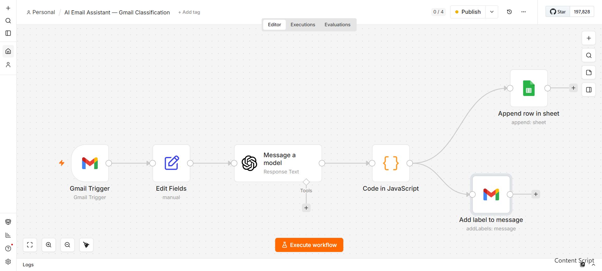
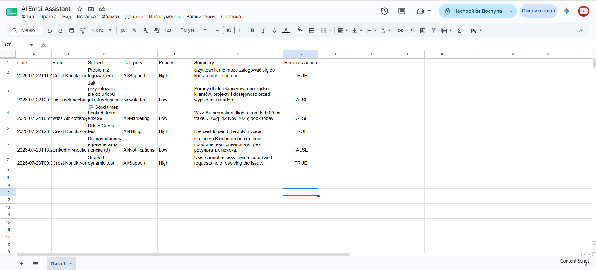
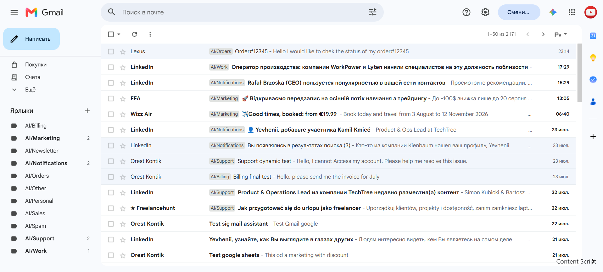

# AI Email Assistant


An intelligent email automation workflow built with **n8n**, **OpenAI**, **Gmail API**, and **Google Sheets**.

The system automatically analyzes incoming emails, classifies them, assigns Gmail labels, detects priority, identifies whether user action is required, generates a short summary, and stores structured data in Google Sheets.

---

## 📌 Overview

AI Email Assistant helps businesses organize incoming email automatically.

Instead of manually sorting invoices, customer requests, notifications, newsletters, marketing messages, and personal emails, the workflow uses OpenAI to analyze every incoming message.

The result is a cleaner Gmail inbox, automatic labeling, and a structured email database that can later be connected to dashboards, CRM systems, or business reporting tools.

---

## 🚀 Business Problem

Managing incoming email manually is time-consuming and inefficient.

Important customer requests can be overlooked, invoices can become mixed with newsletters, and urgent support emails may not receive a timely response.

Businesses need an automated way to classify and organize incoming messages without spending time sorting every email manually.

---

## 💡 Solution

AI Email Assistant automatically processes incoming Gmail messages using OpenAI.

For every email, the workflow:

- Analyzes the content
- Determines the correct category
- Assigns an appropriate Gmail label
- Detects priority
- Identifies whether action is required
- Generates a short AI summary
- Stores the result in Google Sheets

The complete process runs automatically through n8n.

---

## ✨ Features

- AI-powered email classification
- Automatic Gmail label assignment
- Priority detection: High, Medium, or Low
- Required-action detection
- AI-generated email summaries
- Multi-language email processing
- Automatic Google Sheets logging
- Structured output for future integrations
- Fully automated n8n workflow
- Self-hosted deployment on an Ubuntu VPS

---

## 🧠 AI Categories

The assistant classifies incoming emails into the following Gmail categories:

- `AI/Support`
- `AI/Billing`
- `AI/Sales`
- `AI/Orders`
- `AI/Work`
- `AI/Personal`
- `AI/Marketing`
- `AI/Newsletter`
- `AI/Notifications`
- `AI/Spam`
- `AI/Other`

---

## 🏗️ Architecture

```text
Incoming Email
      │
      ▼
Gmail Trigger
      │
      ▼
Field Preparation
      │
      ▼
OpenAI Analysis
      │
      ▼
JavaScript Processing
      │
      ├──────────────► Gmail Label Assignment
      │
      ▼
Google Sheets Logging
```

---

## 🔄 Workflow

1. Gmail Trigger detects a new incoming email.
2. Required email fields are prepared for processing.
3. OpenAI analyzes the email content.
4. AI returns structured classification data.
5. JavaScript validates and normalizes the result.
6. The correct Gmail label is assigned automatically.
7. Email data is saved in Google Sheets.

The structured output includes:

```json
{
  "category": "AI/Orders",
  "priority": "High",
  "summary": "Customer requests a status update for order #12345.",
  "requires_action": true
}
```

---

## ⚙️ Technology Stack

- **Workflow Automation:** n8n
- **Artificial Intelligence:** OpenAI GPT-4o
- **Email Integration:** Gmail API
- **Data Storage:** Google Sheets
- **Custom Processing:** JavaScript
- **Containerization:** Docker
- **Reverse Proxy:** Traefik
- **Database Engine:** PostgreSQL
- **Hosting:** Ubuntu VPS
- **Authentication:** Google OAuth 2.0

---

## 📸 Screenshots

### n8n Workflow

The complete automation workflow connecting Gmail, OpenAI, JavaScript processing, Gmail labels, and Google Sheets.



---

### Google Sheets Results

Structured email data including sender, subject, category, priority, AI summary, and required-action status.



---

### Automatic Gmail Labels

Incoming emails automatically classified into AI-generated Gmail categories.



---

## 📊 Example Results

| Subject | Category | Priority | Requires Action |
|---|---|---|---|
| Login problem | AI/Support | High | Yes |
| Invoice request | AI/Billing | High | Yes |
| Order status request | AI/Orders | High | Yes |
| Flight promotion | AI/Marketing | Low | No |
| LinkedIn notification | AI/Notifications | Low | No |

---

## 💼 Business Value

- Reduces time spent sorting incoming emails
- Helps identify urgent customer requests
- Improves visibility of messages requiring action
- Organizes Gmail automatically
- Creates a structured email database
- Supports multilingual communication
- Provides a foundation for CRM and reporting integrations
- Reduces the risk of important messages being overlooked

---

## 📂 Project Structure

```text
AI-email-assistant/
│
├── README.md
├── LICENSE
├── workflow.json
│
└── screenshots/
    ├── workflow-overview.png
    ├── google-sheets-results.png
    └── gmail-labels.png
```

---

## ▶️ How to Use

1. Import `workflow.json` into n8n.
2. Configure Gmail OAuth credentials.
3. Configure OpenAI API credentials.
4. Connect the required Google Sheets document.
5. Create the Gmail labels listed in the project.
6. Update Gmail label IDs inside the JavaScript node.
7. Activate the workflow.
8. Send a test email and verify the result in Gmail and Google Sheets.

> Credentials, API keys, account IDs, and private configuration data are not included in this repository.

---

## 🛣️ Future Improvements

- AI-generated reply drafts
- Attachment analysis
- CRM integration
- Slack or Microsoft Teams notifications
- VIP customer detection
- Sentiment analysis
- Custom email filtering rules
- User-configurable categories
- RAG knowledge base integration
- Analytics dashboard
- Multi-user support
- Automatic escalation of urgent emails

---

## 👨‍💻 About

Created by **Yevhenii Kuksa** as part of an AI automation portfolio.

The project demonstrates practical experience with:

- AI automation
- n8n workflow development
- OpenAI integration
- Gmail API integration
- Google Sheets automation
- JavaScript data processing
- Docker-based self-hosting
- Business process automation

---

## 📄 License

This project is licensed under the MIT License.
